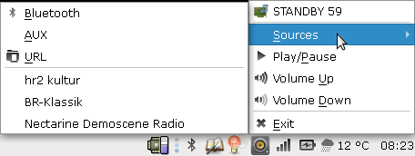

# soundtray

soundtray is a quick-and-dirty system tray application for controlling Bose SoundTouch devices using pyqt4/5 and libsoundtouch.

## Hints

Use the mouse wheel to increase or decrease the volume
